# api.auth

## TS Умная авторизация (api.auth)

Совершенно новый модуль авторизации/регистрации/восстановления пароля.

Все компоненты работают на jQuery.ajax() с возможностью встроенного в Битрикс шифрования или https.

С модулем установится:
1) 7 компонентов, необходимых для хедера сайта, для страницы авторизации, и для замены системной авторизации $APPLICATION->ShowAuthForm()

2) Два почтовых шаблона с возможностью передачи пароля
- API_AUTH_NEW_USER
- API_AUTH_NEW_USER_CONFIRM

3) Заглушка для шаблона компонента bitrix:system.auth.authorize
4) Административные страницы настроек модуля в разделе Сервисы

Вам остается только все настроить, разместить где нужно компоненты и все.

Почти все настройки компонентов вынесены в админку в раздел:
Сервисы - TS Умная авторизация

что позволяет управлять настройками из одного места, а не искать компоненты по шаблонам сайта и каждый отдельно настраивать.

**СКРИНШОТЫ**

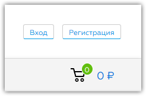
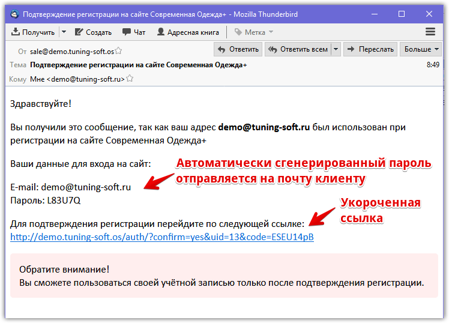
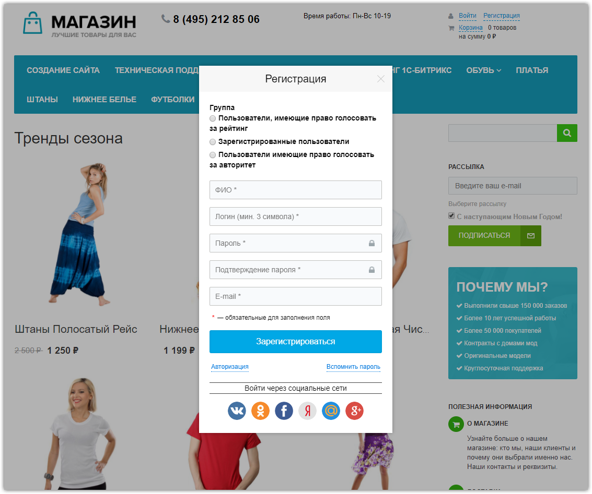
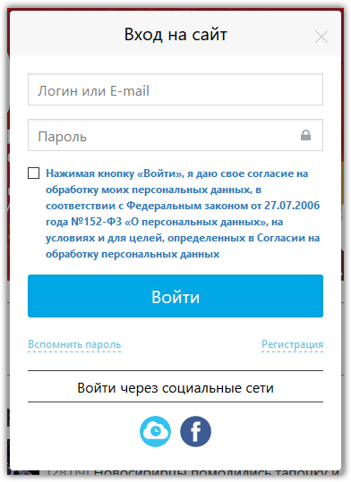
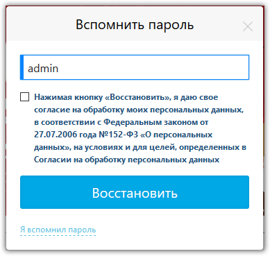
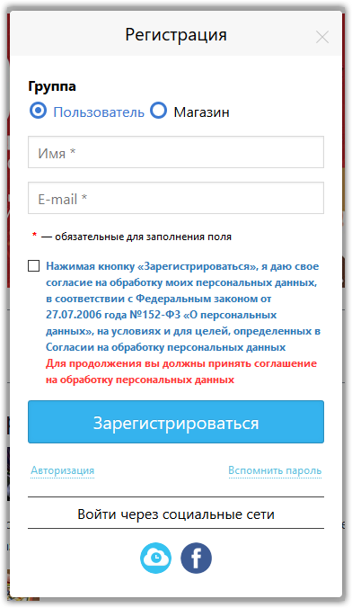
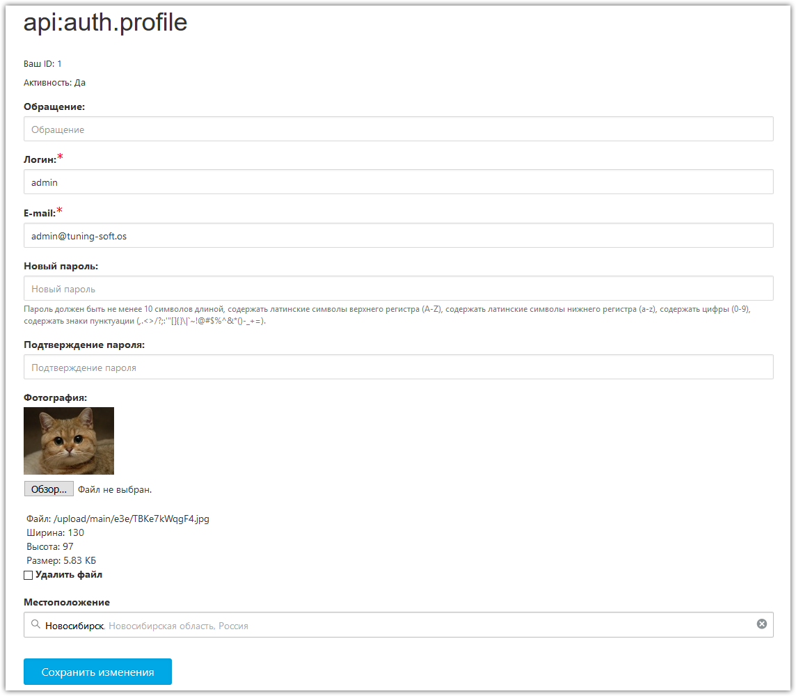
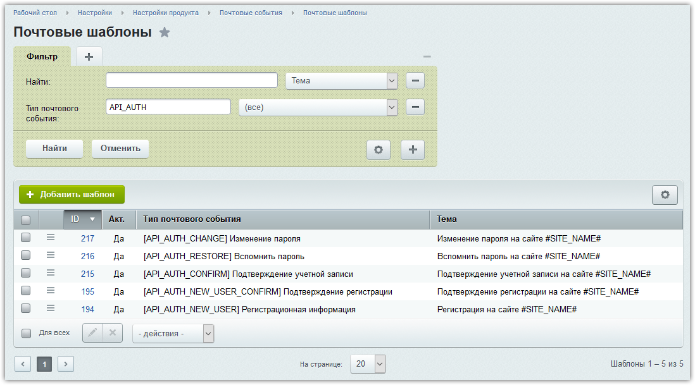
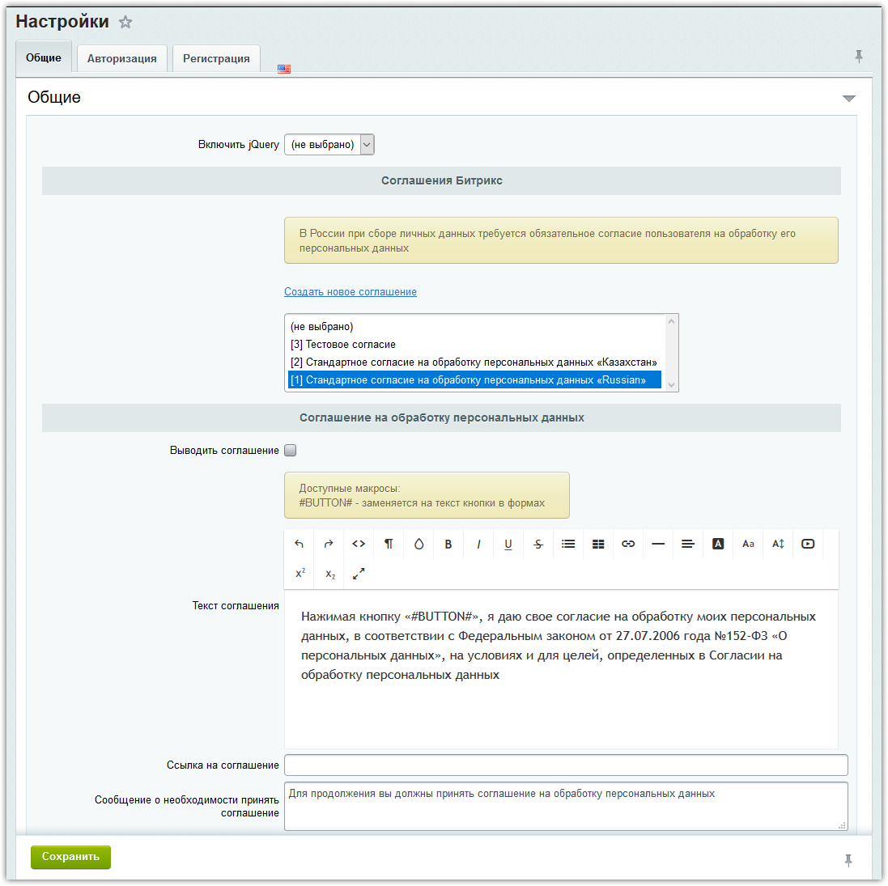
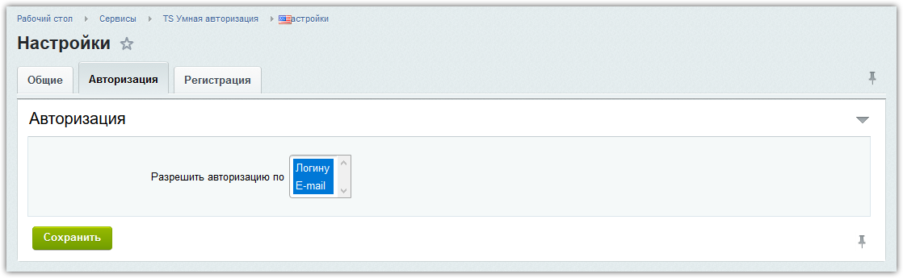
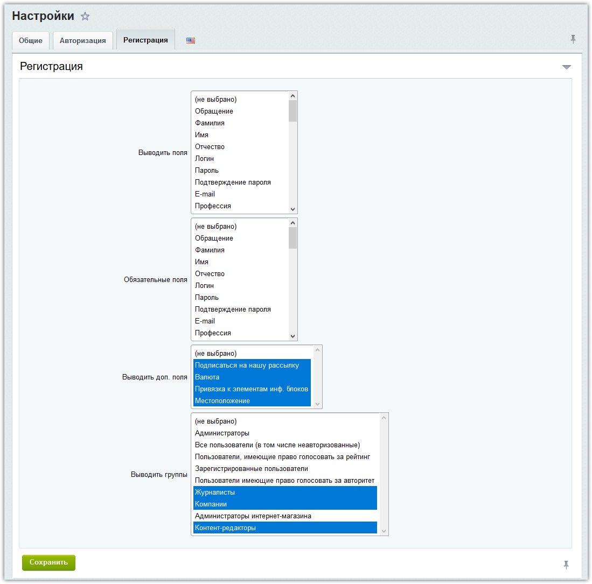
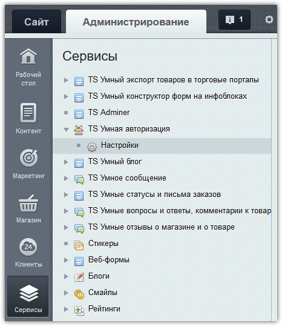